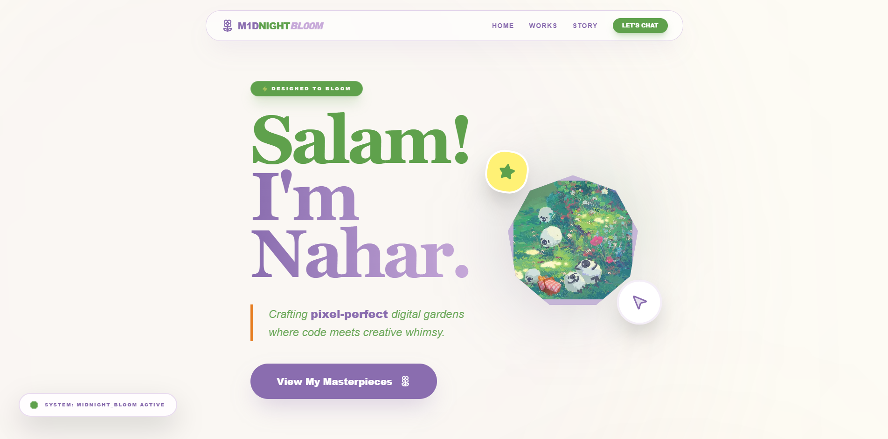
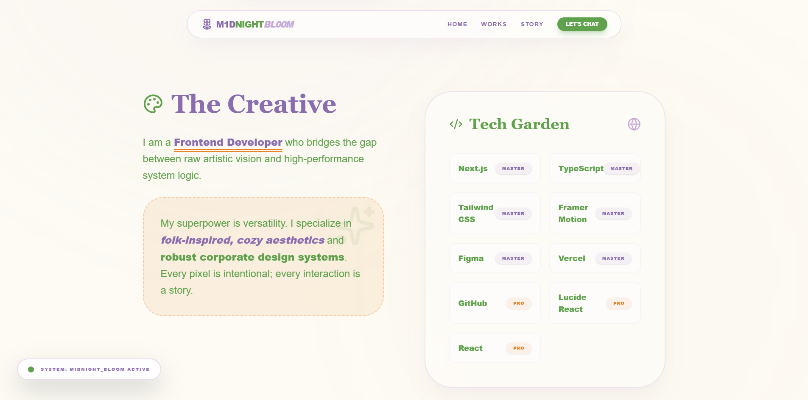
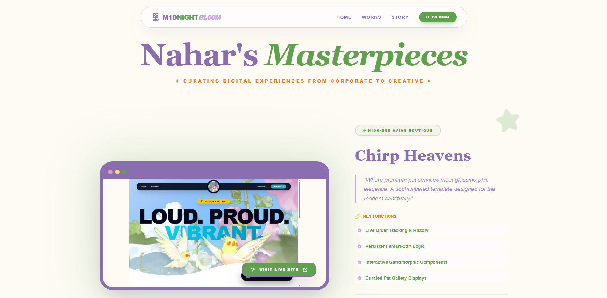
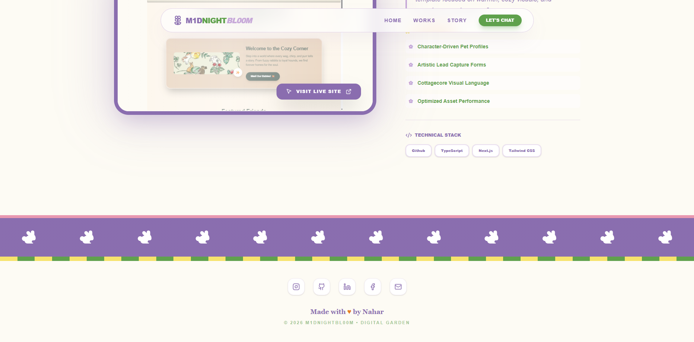
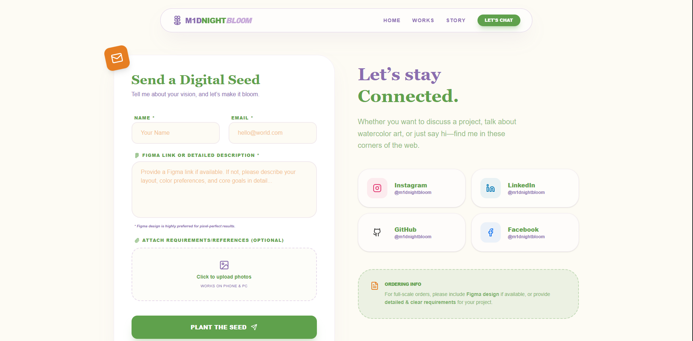

  

  

    <b>m1dnightbl00m</b> is the primary professional and creative portfolio for <b>Mst. Gulnahar</b>. Built with an uncompromising focus on fluid motion and architectural precision, this platform serves as a technical showcase of high-end frontend engineering and intentional UI/UX design.
  

  

---

> [!IMPORTANT]
> **Copyright Notice:** This project is a proprietary design and technical showcase by **Gulnahar**. The source code for this portfolio is **not** open-source. For inquiries regarding custom portfolio builds, please contact Pixel Studio below.

### 📸 Project Gallery

  
<i>Visual highlights of the m1dnightbl00m experience</i>

  <table style="border: none; border-collapse: collapse;">
    <tr>
      <td colspan="2"></td>
    </tr>
    <tr>
      <td></td>
      <td></td>
    </tr>
    <tr>
      <td></td>
      <td></td>
    </tr>
  </table>

---

### 🛠️ The Professional Stack
Built for speed, reliability, and smooth interaction.

  
  
  
  

---

### ✨ Advanced Features Spotlight

* **🎭 Physics-Based Motion:** Highly intentional transitions and scroll-triggered animations powered by Framer Motion.
* **🌑 Dynamic Midnight Mode:** A sophisticated dark-themed UI designed for visual comfort and elegance.
* **🚀 Optimized Architecture:** Utilizing Next.js 14 App Router for lightning-fast performance and SEO.
* **📱 Ultra-Responsive:** Pixel-perfect fluid layouts that adapt seamlessly from desktop to mobile.
* **🎨 Artistic vs. Logic:** A perfect blend of "Midnight Bloom" aesthetics with industrial-grade code quality.

---

### 🌙 The Design Philosophy
The aesthetic is **"Midnight Bloom"** — a professional, sophisticated contrast to the warm, earth-toned "Technical Garden." It represents the intersection of logic and creative flourishing.

* **🎨 Palette:** Sap greens, soft midnight purples, with yellow and orange accents.
* **✨ Motion:** Intentional layout transitions and smooth exit/entry animations.
* **📐 Layout:** Scalable, component-driven architecture using React Server Components.

---

### 🚀 Explore The Ecosystem

* **🥐 Cinnabloom Bakery** | [Premium Delivery Template](https://github.com/Mst-Gulnahar/cinnabloom-bakery)
* **🍯 Honey Haze** | [Cafe & Boutique Experience](https://honey-haze.vercel.app/)
* **💎 Pixel Studio** | [Official Studio Site](https://pixel-studio-opal.vercel.app/)

---

### 🎨 Creative Credits
* **Lead Developer & Designer:** Mst. Gulnahar
* **Studio:** Pixel Studio
* **Philosophy:** High-end functional art for the modern web.

---

### 📩 Contact & Inquiries
Looking for a unique, high-end digital identity?
* **Email:** `pixelstudioo003@gmail.com`
* **Portfolio:** [m1dnightbl00m.vercel.app](https://m1dnightbl00m.vercel.app/)
* **Studio:** [Pixel Studio](https://pixel-studio-opal.vercel.app/)

 

  

